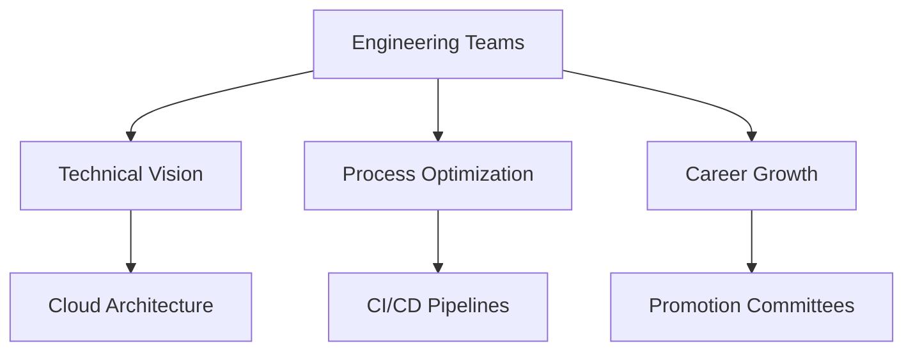
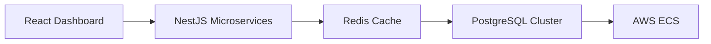

# Hi there 👋 I'm Leo

<div align="center">
  
</div>

## 🎨 Technical Palette

```
  _____ _             _     ___  ___          _                  
 |_   _| |_  ___  ___| |_  | _ \/ _ \___ _ _| |_ ___ _ _ ___ ___
   | | | ' \/ _ \/ _ \  _| |  _/ (_) / -_) ' \  _/ _ \ '_(_-</ -_)
   |_| |_||_\___/\___/\__| |_|  \___/\___|_||_\__\___/_| /__/\___|
```

## 🌟 Core Expertise

### **Leadership & Mentorship** 👨💼
- Led engineering teams across 12+ product launches
- Mentored 50+ engineers in career development
- Established cross-functional DevOps practices
- Authored internal engineering playbooks
- Conducted 1000+ code reviews



### **Technical Pillars**
| **Frontend**       | **Backend**        | **Cloud**          | **Data**           |
|---------------------|--------------------|--------------------|--------------------|
| TypeScript 🟦       | Node.js 🟩         | AWS ☁️             | PostgreSQL 🐘      |
| React ⚛️           | Rust 🦀            | Kubernetes 🚢      | Redis 🔴           |
| Next.js ⏭️         | Python 🐍          | Terraform 🏗️       | MongoDB 🍃         |
| React Native 📱     | GraphQL 🎯         | Docker 🐳          | Spark ✨           |

## 🏗️ Recent Initiatives

<details>
<summary>🏦 Financial Analytics Platform</summary>



- Led 8-engineer team to 2.4x performance gains
- Implemented real-time trading alerts
</details>

<details>
<summary>🤖 ML Supply Chain Optimizer</summary>

```python
def optimize_routes(predictions):
    # Transformer-based demand forecasting
    model = AutoModelForSequenceClassification.from_pretrained("bert-base")
    # Genetic algorithm optimization
    return genetic_algorithm(model.predict(predictions))
```

- Reduced logistics costs by 18%
- Mentored junior ML engineers
</details>


## 📜 Leadership Philosophy
> "The best architectures emerge from teams, not individuals.  
> Our role is to cultivate environments where great ideas can collide."  

## 🌈 Let's Create
- 🔭 Exploring elegant systems design
- 🎨 Blending technical and creative disciplines
- 🤝 Open to architectural mentorship roles
- 📬 Connect via [LinkedIn](https://www.linkedin.com/in/alleo-indong-a17b2199/)

<div align="center">
  
</div>
